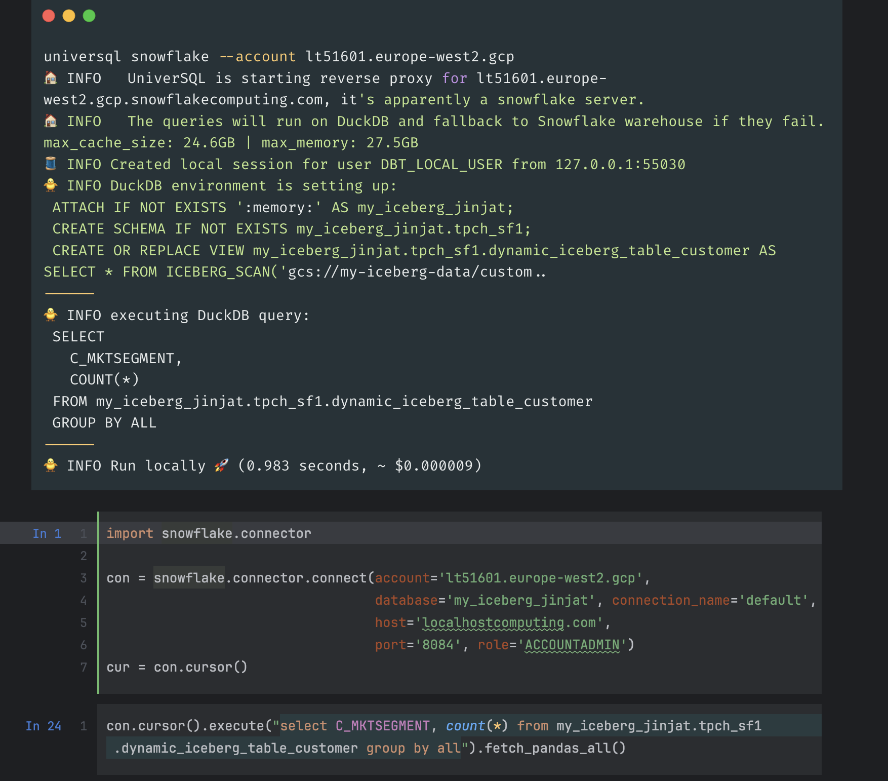
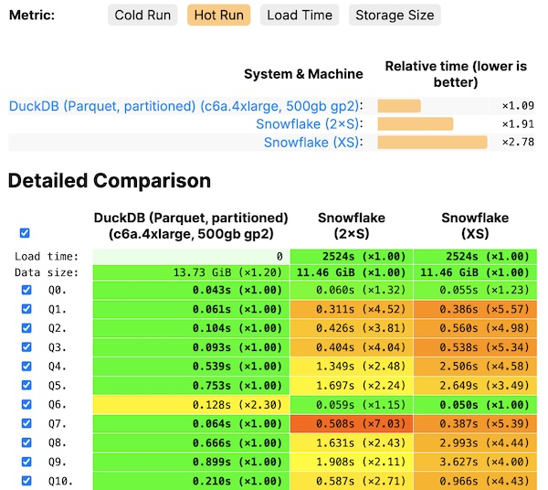

# UniverSQL

## Overview

UniverSQL is a Snowflake proxy that allows you to run SQL queries **locally** on Snowflake Iceberg tables and Polaris Catalog using DuckDB.

You can join Snowflake data with local datasets **without requiring a running Snowflake warehouse**.

UniverSQL relies on Snowflake for access control and data catalog functionality, making it complementary to existing Snowflake workloads.

> [!WARNING]
> Any SQL client that supports Snowflake can also be used with UniverSQL because UniverSQL implements the Snowflake API for compatibility.
>
> If you encounter compatibility issues with an application or SQL client, open an issue or discussion in the project repository.

> [!NOTE]
> UniverSQL is an independent project and is not affiliated with Snowflake.



[Watch the demo on YouTube](https://www.youtube.com/watch?v=s1fpSEE-pAc)

[](https://github.com/codespaces/new?hide_repo_select=true&ref=main)

When you query an Iceberg table on Snowflake for the first time, UniverSQL:

1. Looks up Iceberg metadata from Snowflake without incurring warehouse compute.
2. Rewrites the query for the DuckDB SQL dialect.
3. Configures a filesystem connection to the data lake using your cloud credentials.
4. Caches the Parquet files locally.
5. Executes the query using DuckDB.

## Use Cases

* **Smart caching for Snowflake queries**
  Reduce compute usage by optimizing queries and reusing locally cached data across multiple executions.

* **Query local files**
  Prototype with local datasets without uploading them to Snowflake. Upload data to the cloud only when you are ready to publish it.

* **Use local hardware for analytics**
  Run analytical queries on your own hardware and work with data locally when network connectivity is unavailable.

* **DuckDB as a local warehouse**
  For managed or on-premise Polaris Catalog deployments, UniverSQL can use embedded DuckDB as a local warehouse when a Polaris account is supplied through the `--account` parameter.

## Getting Started

### Access to Storage

#### Snowflake

Snowflake does not provide direct access to the underlying data lake in the same way a local application can access it. UniverSQL therefore uses your local cloud credentials to access the storage layer.

Configure the appropriate cloud SDK and credentials before querying Iceberg data.

#### Polaris

Polaris Catalog is an Iceberg table catalog available through Snowflake.

It manages access credentials for the data lake and metadata for Iceberg tables.

If your Snowflake account (`--account`) is backed by Polaris Catalog, UniverSQL uses PyIceberg to retrieve data from the data lake and maps it into Arrow tables for DuckDB.

### AWS

Install and configure the [AWS CLI](https://docs.aws.amazon.com/cli/latest/userguide/getting-started-install.html).

You can configure credentials using:

```bash
aws configure
```

By default, UniverSQL uses the default AWS profile. Use `--aws-profile` to specify another profile.

### Google Cloud

Install and configure the [Google Cloud SDK](https://cloud.google.com/sdk/docs/initializing).

You can authenticate using:

```bash
gcloud auth application-default login
```

By default, UniverSQL uses the default GCP account configured with `gcloud`.

### Azure

Install and configure the [Azure CLI](https://learn.microsoft.com/en-us/cli/azure/install-azure-cli).

By default, UniverSQL uses the active Azure tenant configured with `az`.

## Python

Install UniverSQL with pip:

```bash
python3 -m pip install universql
```

### Using Virtual Environments

Create a virtual environment:

```bash
python -m venv universql-env
```

Activate it on macOS/Linux:

```bash
source universql-env/bin/activate
```

On Windows:

```powershell
universql-env\Scripts\activate
```

Start the Snowflake proxy:

```bash
universql snowflake --account lt51601.europe-west2.gcp
```

## Docker

Alternatively, pull and run the Docker image:

```bash
docker run -p 8084:8084 \
  -v ~/.universql:/root/.universql \
  buremba/universql \
  snowflake --account lt51601.europe-west2.gcp
```

Docker is useful when running UniverSQL as a background service.

## Docker Compose

Copy the example environment file:

```bash
cp .env.example .env
```

Update the configuration values as needed.

> [!NOTE]
> SSL certificates are not included in the repository and are optional. If SSL is required, generate your own certificates, place them in the `ssl` directory, and update the `.env` configuration accordingly.

Start the services:

```bash
docker compose up
```

## How It Works

UniverSQL consists of several components working together:

* **Snowflake SQL API implementation**
  Handles Snowflake-compatible connections and acts as a proxy between clients, DuckDB, and Snowflake.

* **Snowflake client compatibility**
  Clients can connect through Snowflake Python Connector, Snowflake JDBC, ODBC, or other Snowflake-compatible tools.

* **Snowflake Arrow integration**
  Retrieves data through Snowflake and converts the results into DuckDB-compatible Arrow relations.

* **SQL translation**
  [SQLGlot](https://sqlglot.com) and [Fakesnow](https://github.com/tekumara/fakesnow) translate Snowflake SQL into DuckDB-compatible SQL.

* **Iceberg and Polaris Catalog**
  [Snowflake Iceberg Tables](https://docs.snowflake.com/en/user-guide/tables-iceberg) and [Polaris](https://other-docs.snowflake.com/en/polaris/overview) provide the data catalog layer depending on the configured account.

* **Local data lake access**
  Local storage provides direct access to cloud data lakes such as S3 and GCS.

* **DuckDB**
  [DuckDB](https://duckdb.org) provides the local analytical compute engine.

## CLI

Run:

```text
universql snowflake --help
```

Example options:

```text
Usage: universql snowflake [OPTIONS]

Options:

  --account TEXT
      The account to use. Supports both Snowflake and Polaris
      (e.g. rt21601.europe-west2.gcp)

  --port INTEGER
      Port for the Snowflake proxy server (default: 8084)

  --host TEXT
      Host for the Snowflake proxy server

  --metrics-port TEXT
      Grafana metrics port

  --account-catalog [snowflake|polaris]
      Type of Snowflake account.
      Automatically detected when not provided.

  --universql-catalog TEXT
      External catalog used for Iceberg tables.
      Default: duckdb:///:memory:

  --aws-profile TEXT
      AWS profile used to access S3.
      Default: default

  --gcp-project TEXT
      GCP project used to access GCS and apply quota.

  --ssl_keyfile TEXT
      SSL keyfile for the proxy server.

  --ssl_certfile TEXT
      SSL certificate file for the proxy server.

  --max-memory TEXT
      Maximum DuckDB memory available to the server.
      Default: 80% of total memory.

  --cache-directory TEXT
      Data lake cache directory.

  --home-directory TEXT
      Home directory for local operations.

  --max-cache-size TEXT
      Maximum local disk cache size.
      Default: 80% of available disk.

  --database-path PATH
      Path to a persistent DuckDB database file.
      Default: :memory:

  --tunnel [cloudflared|ngrok]
      Use a tunnel to make the server accessible from the public internet.

  --help
      Show this message and exit.
```

## Limitations

### Be Aware of Trade-Offs

UniverSQL is designed as a complementary tool for using local hardware with Snowflake, particularly for small and medium-sized analytical workloads.

Snowflake virtual warehouses are designed to efficiently process large queries and large datasets. UniverSQL instead allows suitable workloads to execute locally using DuckDB.

### Cost

A Snowflake X-Small warehouse can be sufficient for many ad-hoc queries involving smaller datasets.

When a query can execute locally and your computer has sufficient resources, the local compute does not require Snowflake warehouse credits.

However, accessing cloud data locally may incur **network egress costs** from the cloud provider.

### Performance

UniverSQL uses DuckDB as its local analytical engine. DuckDB is a columnar database optimized for analytical workloads.

Queries that fit comfortably within available memory can execute quickly. Performance for larger queries depends on:

* Local CPU performance
* Available memory
* Disk speed
* Network bandwidth
* Amount of data that must be downloaded
* Query complexity

UniverSQL can be used for prototyping and ad-hoc workloads on smaller datasets. Queries that cannot be executed locally can be routed to Snowflake.



[ClickBench Results](https://benchmark.clickhouse.com/)

### Latency

Latency depends heavily on available network bandwidth.

The local disk is used to cache data from the data lake. The cache is populated lazily as data is queried and persists across subsequent runs.

**Cold runs** can be slower than Snowflake because UniverSQL must download data from the data lake while Snowflake performs compute within the cloud environment.

**Hot runs** can be substantially faster because previously downloaded data is served from the local cache.

When an Iceberg table is updated, only newly required data is downloaded.

The same data is not unnecessarily downloaded multiple times.

Iceberg predicate pushdown can further reduce the amount of data downloaded when querying partitioned tables.

## SSL Certificates and Snowflake SQL V1 API

The Snowflake SQL V1 API requires a valid CA certificate. Self-signed certificates are generally unsuitable for this configuration.

UniverSQL can use a certificate associated with its local host configuration, or you can provide your own certificates through:

```text
--ssl_keyfile
--ssl_certfile
```

> [!NOTE]
> When using a local DNS-based configuration that resolves directly to your own machine, data does not need to pass through an external application server. Verify the DNS and certificate configuration before using such a setup in production or sensitive environments.

For direct localhost access, [mkcert](https://github.com/FiloSottile/mkcert) can be used to generate locally trusted certificates.

## Native Snowflake Tables

UniverSQL cannot directly query native Snowflake tables because those tables are not exposed through the data lake layer.

For example:

```sql
SELECT * FROM my_snowflake_table;
```

There are two alternatives.

### 1. Use a Dynamic Iceberg Table

Create a dynamic Iceberg table that replicates the native Snowflake table:

```sql
CREATE DYNAMIC ICEBERG TABLE my_iceberg_snowflake_table
  TARGET_LAG = '1 hour'
  WAREHOUSE = 'compute_xs'
  CATALOG = 'SNOWFLAKE'
  EXTERNAL_VOLUME = 'your_data_lake_volume'
  BASE_LOCATION = 'my_transformed_table'
  REFRESH_MODE = auto
  INITIALIZE = on_create
AS
SELECT * FROM my_snowflake_table;
```

This approach allows large native tables to be filtered or aggregated before the resulting data is accessed locally.

### 2. Use `to_query`

The `to_query` function can execute a query directly in Snowflake and return its result as a table.

For example:

```sql
SELECT *
FROM table(
  to_query('select col1 from my_snowflake_table')
)
WHERE col1 = 2;
```

When using the proxy server, UniverSQL creates a query plan that executes the Snowflake query first and maps the result into an Arrow table in DuckDB.

This approach is useful for hybrid execution where native Snowflake tables need to be queried alongside local or Iceberg data.

## External Tools Require a Tunnel

If your local computer is not accessible from the public network, external services such as hosted notebooks and cloud-based BI tools may not be able to connect to UniverSQL.

A public tunnel can be used to expose the local server:

```text
--tunnel cloudflared
```

or:

```text
--tunnel ngrok
```

## Snowflake SQL V2 API

UniverSQL currently focuses on the Snowflake SQL V1 API.

Many Snowflake clients, including JDBC, Python, and ODBC integrations, use the V1 API.

Support for the [Snowflake SQL API V2](https://docs.snowflake.com/en/developer-guide/sql-api/intro) can be added as the project evolves.

## SQL Syntax Support

| Syntax                      | Explanation                                                                                                                             |
| --------------------------- | --------------------------------------------------------------------------------------------------------------------------------------- |
| `SELECT`                    | Supported for querying available local, Iceberg, and Snowflake-backed data.                                                             |
| `CREATE ICEBERG TABLE`      | The `AS SELECT` portion can execute in DuckDB. Metadata can be synchronized with the configured external Iceberg catalog and Snowflake. |
| `INSERT`, `MERGE`, `DELETE` | Executed in DuckDB when operating on temporary and Iceberg tables; otherwise routed to Snowflake.                                       |
| `CREATE TABLE`              | Table creation and metadata management are handled by Snowflake.                                                                        |
| `CREATE TEMP TABLE`         | Temporary tables are managed by DuckDB, with related DML and `AS SELECT` operations executed locally.                                   |
| `COPY INTO`                 | Executed locally when the query references temporary or Iceberg tables; otherwise routed to Snowflake.                                  |
| `SHOW`                      | Metadata queries are executed by Snowflake. A running warehouse is generally not required for metadata queries.                         |

## Contributing

Contributions are welcome. You can submit bug reports, feature requests, documentation improvements, or pull requests through the repository.

## License

This project is licensed under the MIT License.
